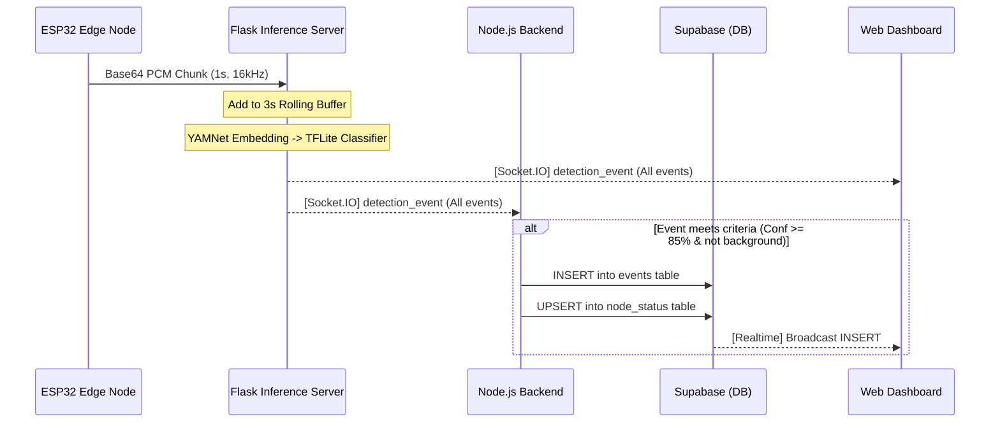

# Edge-AI Acoustic Event Detection — Project Documentation

This document outlines the final implementation details, architecture, and design decisions for the Distributed Edge-AI Acoustic Event Detection network.

## 1. System Overview

The system captures real-world audio on low-power microcontrollers (ESP32) and streams it to a central inference server for processing. Using a combination of a robust pre-trained acoustic model (Google's YAMNet) and a lightweight custom classifier, the system accurately detects 6 different acoustic events (e.g., breaking glass, sirens, gunshots) in real-time. High-confidence detections are persisted in a cloud database while a web dashboard provides a live, neon-styled visual feed.

## 2. Component Architecture

### 2.1 Edge Microcontrollers (`node1/`, `node2/`)
- **Hardware Profile:** ESP32 with an INMP441 I2S digital microphone.
- **Firmware:** MicroPython.
- **Audio Capture:** Reads 16kHz, 16-bit mono audio. Captures 1 second of audio at a time (32,000 bytes).
- **Transmission:** Base64-encodes the raw PCM data and streams it to the Flask server via a custom, memory-optimised WebSocket implementation (bypassing the heavy standard Socket.IO client to avoid memory allocation errors).

### 2.2 ML Inference Server (`flask_server/`)
- **Framework:** Python, Flask, Flask-SocketIO (Eventlet async mode).
- **Buffer Management:** Maintains a 3-second rolling circular buffer of audio per connected node. It waits until the buffer is full before running the first inference, then runs inference continuously as new 1-second chunks arrive.
- **Machine Learning Pipeline:**
  1. **YAMNet (TensorFlow Hub):** Converts the 3 seconds of raw audio waveform into a dense 1024-dimensional semantic embedding.
  2. **Dense Classifier (TFLite):** A custom-trained TensorFlow Lite model takes the 1024-dim embedding and outputs class probabilities for 6 categories.
- **Event Emission:** Emits a `detection_event` back via Socket.IO containing the `node_id`, `event_type`, `confidence`, and `alert_priority`. A `stored` boolean flag dictates if the event meets the persistence threshold (confidence >= 85% and not ambient noise).

### 2.3 Persistence Backend (`backend/`)
- **Framework:** Node.js, Express.
- **Data Store:** Supabase (PostgreSQL).
- **Flask Bridge Service:** Connects as a Socket.IO client to the Flask server. Listens for `detection_event` payloads.
- **Persistence Logic:** If the event has `stored: true`, the Node.js server securely inserts the event into the `events` table and upserts the node's health status in the `node_status` table. 
- **Legacy Support:** Contains an `mqttService.js` that can still receive and process standard MQTT payloads, ensuring backwards compatibility with older nodes.

### 2.4 Live Dashboard (`monitoring.html`, `script.js`)
- **Stack:** Pure HTML5, CSS3, Vanilla JavaScript. No bundlers or frameworks.
- **Dual Live Feed:**
  1. **Direct Flask Connection:** Uses Socket.IO to subscribe directly to the inference server. Updates node cards with flashing waveforms and populates the live event feed, styling ambient noise and low-confidence events differently.
  2. **Supabase Realtime:** Subscribes to database `INSERT` events to guarantee historical delivery of high-confidence alerts, triggering alert sounds and stat counters.
- **Visuals:** Cyber-neon aesthetic using glassmorphism, CSS keyframe animations, and deep color palettes.

## 3. Data Flow Diagram

## 4. Class & Priority Mapping

The TFLite classifier outputs probabilities for 6 distinct classes. These are mapped to alert priorities on the Flask server before being broadcast.

| Class ID | Event Type | Alert Priority | UI Badge Color | Action |
| :--- | :--- | :--- | :--- | :--- |
| `0` | `background` | `none` | Gray | Discarded from DB, shown dimmed in UI |
| `1` | `dog` | `low` | Blue | Saved if conf >= 85% |
| `2` | `glass_break` | `medium` | Yellow | Saved if conf >= 85% |
| `3` | `gunshots` | `critical`| Red | Saved if conf >= 85% |
| `4` | `scream` | `high` | Orange | Saved if conf >= 85% |
| `5` | `siren` | `medium` | Yellow | Saved if conf >= 85% |

## 6. Simulated Hardware Testing

To test the system without real ESP32 hardware, the script `flask_server/test_stream.py` is provided. 
- It reads a `test_sound.wav` file (or generates random noise).
- It splits the audio into 1-second chunks and base64 encodes it.
- It streams the chunks as `node_1`, waits 2 seconds, and then repeats the stream as `node_2`.
- This fully exercises the server buffers, ML pipeline, Node.js bridge, and dashboard UI.
